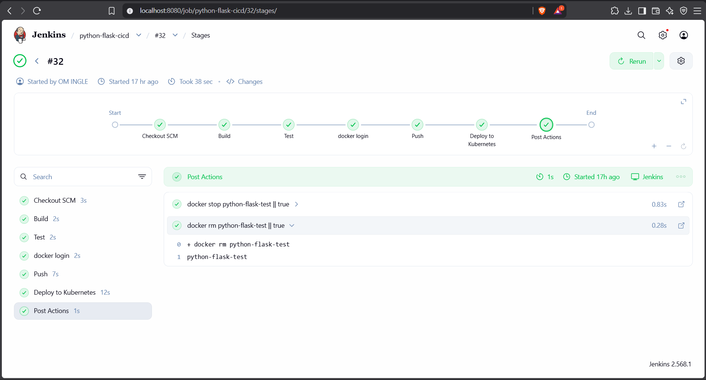
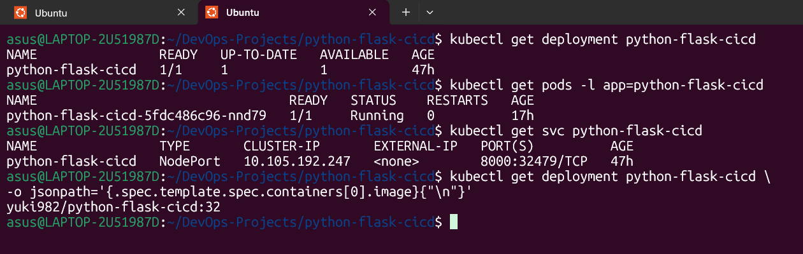
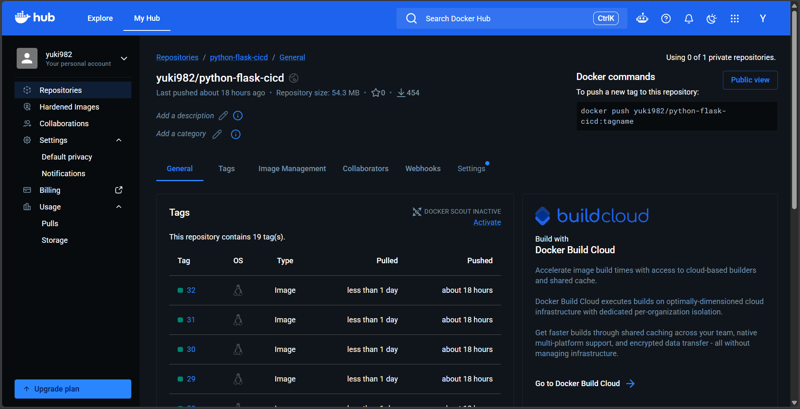
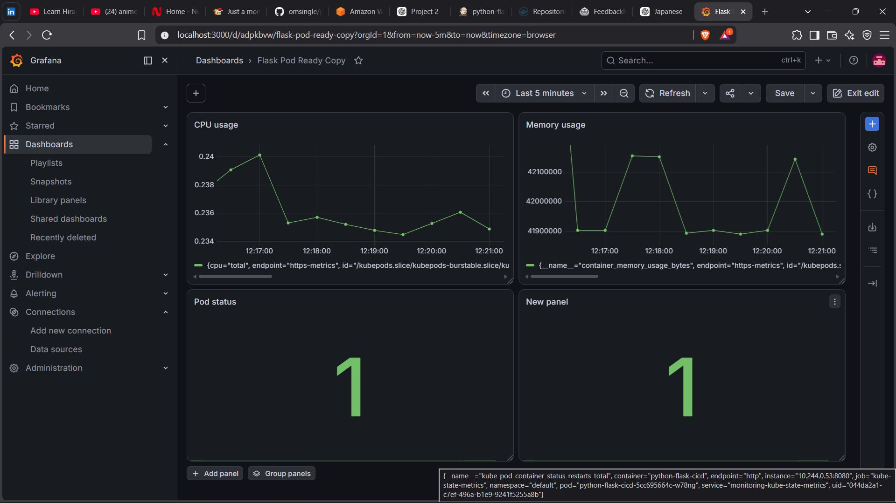

# FastAPI CI/CD with Docker, Jenkins & Kubernetes

A hands-on DevOps project demonstrating automated CI/CD for a FastAPI application using Jenkins, Docker, Docker Hub, and Kubernetes.

## 🚀 Project Overview

The project automates the complete application delivery process:

```text
GitHub
   ↓
Jenkins
   ↓
Docker Build
   ↓
Automated Health Test
   ↓
Docker Hub
   ↓
Kubernetes
   ↓
Rolling Deployment
   ↓
FastAPI Application
```

The Kubernetes environment also includes health checks, resource management, ConfigMaps, Secrets, Ingress, Prometheus, and Grafana.

## 🏗️ Architecture

```text
                         ┌──────────────┐
                         │    GitHub    │
                         └──────┬───────┘
                                │
                                ▼
                         ┌──────────────┐
                         │   Jenkins    │
                         └──────┬───────┘
                                │
                    ┌───────────┼───────────┐
                    ▼           ▼           ▼
                  Build        Test        Push
                                │           │
                                └─────┬─────┘
                                      ▼
                               ┌──────────────┐
                               │  Docker Hub  │
                               └──────┬───────┘
                                      │
                                      ▼
                              ┌───────────────┐
                              │  Kubernetes   │
                              │               │
                              │  Deployment   │
                              │      ↓        │
                              │     Pods      │
                              │      ↓        │
                              │   Service     │
                              │      ↓        │
                              │   Ingress     │
                              └──────┬────────┘
                                     │
                                     ▼
                               ┌───────────┐
                               │  FastAPI  │
                               └───────────┘

                         Monitoring
                             │
                    ┌────────┴────────┐
                    ▼                 ▼
               Prometheus          Grafana
```

## 🛠️ Technologies

- Python
- FastAPI
- Uvicorn
- Git & GitHub
- Docker
- Jenkins
- Docker Hub
- Kubernetes
- ConfigMaps & Secrets
- Service & Ingress
- Liveness & Readiness Probes
- Prometheus
- Grafana
- Linux

## 📁 Project Structure

```text
python-flask-cicd/
│
├── app/
│   ├── app.py
│   └── requirements.txt
│
├── k8s/
│   ├── deployment.yaml
│   ├── service.yaml
│   ├── ingress.yaml
│   └── configmap.yaml
│
├── jenkins/
│   └── Dockerfile
│
├── Dockerfile
├── Jenkinsfile
├── .dockerignore
├── .gitignore
└── README.md
```

## 🔄 CI/CD Pipeline

The project uses a Jenkins Declarative Pipeline with the following stages:

### Build

Builds a versioned Docker image using the Jenkins build number.

```bash
docker build -t yuki982/python-flask-cicd:${BUILD_NUMBER} .
```

Example:

```text
yuki982/python-flask-cicd:32
```

### Test

Runs the newly built container and checks the FastAPI health endpoint.

```bash
curl -f http://python-flask-test:8000/health
```

Expected response:

```json
{
  "status": "healthy"
}
```

The pipeline uses retries to allow the application to start before testing.

### Docker Hub

Jenkins securely retrieves Docker Hub credentials from Jenkins Credentials, logs in, and pushes the tested image.

### Kubernetes Deployment

Jenkins updates the Kubernetes Deployment with the new image:

```bash
kubectl set image deployment/python-flask-cicd \
python-flask-cicd=yuki982/python-flask-cicd:${BUILD_NUMBER}
```

Kubernetes performs a rolling update and Jenkins waits for the rollout to complete:

```bash
kubectl rollout status deployment/python-flask-cicd
```

## 🐳 Docker

The application is containerized using `python:3.13-slim`.

The Dockerfile:

- Installs dependencies from `requirements.txt`
- Copies the FastAPI application
- Exposes port `8000`
- Runs the application using Uvicorn

Run locally:

```bash
docker build -t python-flask-cicd .
docker run -p 8000:8000 python-flask-cicd
```

Test:

```bash
curl http://localhost:8000/health
```

## ☸️ Kubernetes

The application is deployed using a Kubernetes Deployment.

Implemented Kubernetes features:

- Rolling updates
- Self-healing
- Liveness probes
- Readiness probes
- CPU and memory requests/limits
- ConfigMaps
- Secrets
- NodePort Service
- NGINX Ingress

Useful commands:

```bash
kubectl get pods
kubectl get deployment
kubectl get service
kubectl describe pod <pod-name>
kubectl logs <pod-name>
```

## 📈 Monitoring

Prometheus is used to collect Kubernetes/application metrics and store them as time-series data.

Grafana is connected to Prometheus to visualize metrics through dashboards.

The dashboard includes monitoring such as:

- CPU usage
- Memory usage
- Pod status
- Kubernetes metrics

## 📸 Project Screenshots

### Jenkins CI/CD Pipeline



### Kubernetes Deployment



### Docker Hub



### Grafana Monitoring



## ▶️ How to Run

### Run FastAPI Locally

Clone the repository:

```bash
git clone https://github.com/omsingle/python-flask-cicd.git
cd python-flask-cicd
```

Install dependencies:

```bash
pip install -r app/requirements.txt
```

Start the application:

```bash
uvicorn app.app:app --host 0.0.0.0 --port 8000
```

Test:

```bash
curl http://localhost:8000/health
```

### Run with Docker

```bash
docker build -t python-flask-cicd .
docker run -p 8000:8000 python-flask-cicd
```

### Deploy to Kubernetes

```bash
kubectl apply -f k8s/configmap.yaml
kubectl apply -f k8s/deployment.yaml
kubectl apply -f k8s/service.yaml
kubectl apply -f k8s/ingress.yaml
```

Verify:

```bash
kubectl get pods
kubectl get deployment
kubectl get service
kubectl get ingress
```

> The Kubernetes Deployment references a Secret named `python-flask-secret`. Create the required Secret separately and never commit real credentials to GitHub.

## 🎯 What I Learned

Through this project I gained practical experience with:

- CI/CD pipeline automation
- Jenkins Declarative Pipelines
- Docker containerization
- Docker image versioning
- Automated application testing
- Secure Jenkins credentials
- Docker Hub
- Kubernetes deployments
- Rolling updates
- Health probes
- ConfigMaps & Secrets
- Kubernetes networking
- Prometheus & Grafana
- CI/CD and Kubernetes troubleshooting

## 🚀 Future Improvements

- Helm chart integration
- Horizontal Pod Autoscaling
- Terraform infrastructure
- AWS cloud deployment
- Centralized logging

## 👨‍💻 Author

**Om Ingle**

GitHub: https://github.com/omsingle

LinkedIn: https://www.linkedin.com/in/om-ingle-00403b417/